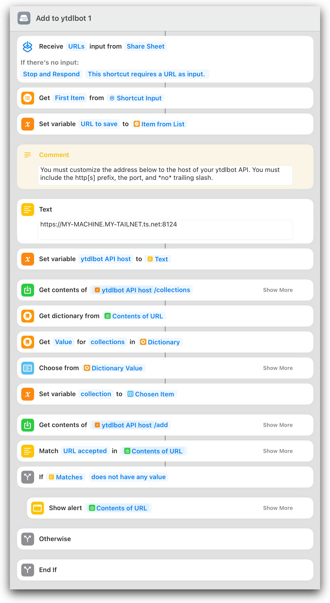

# ytdlbot

A tool for collecting videos from YouTube & similar sites.

I use ytdlbot to collect [music videos](https://www.youtube.com/watch?v=ebJ2brErERQ), [photography videos](https://www.youtube.com/watch?v=5fneU1FlEP0), ["nature relaxation"-style videos](https://www.youtube.com/watch?v=lM02vNMRRB0), and [comedy bits](https://www.youtube.com/watch?v=ZDOI0cq6GZM) I'll want to reference often.

## Deploying & Configuring

A deployment of ytdlbot requires Docker and includes:

- `ytdlbot-api`, which accepts requests to add videos to your collections.
- `ytdlbot-processor`, which works through the download queue and files videos in the requested collection. This is the Docker container on which you'll set environment variables to customize how your media is filed.

Optionally, the deployment may use:

- [`docker compose`](https://docs.docker.com/compose/) for easier deployment management
- [Netdata](https://www.netdata.cloud) for monitoring & metrics
- [Tailscale](https://tailscale.com) for remote access
- [1Password CLI](https://developer.1password.com/docs/cli/) for accessing credentials

### UID and GID

#### ytdlbot-processor

The processor container respects the environment variables `PUID` and `PGID` to ensure saved videos and log files are owned by the correct user on the host system.

If you're using Netdata to collect metrics, you should also set the `NETDATA_GID` variable to the ID of the `netdata` _group_ on the host system.

#### ytdlbot-api

The API container should simply be run as the same user as the processor container's `PUID`/`PGID` variables, using Docker's native [`--user`](https://docs.docker.com/engine/reference/run/#user) setting.

### Timezone

The processor container will write log files containing timestamps. By default these are in UTC. You may set the `TZ` environment variable (for example, `TZ=America/Detroit`) to make these timestamps match your local system.

### Directories/Volumes

#### You'll need to pick a directory to store your video collections.

Map this folder into both the API and processor Docker containers like the following:

```
"/mnt/storage/my-ytdlbot-media:/ytdlbot-media"
```

#### You may pick a directory to store logs from the queue processor.

If you want logs from the queue processor to be persisted somewhere you can easily browse them, map the following volume on the processor Docker container:

```
"/home/me/ytdlbot-logs:/ytdlbot-logs"
```

#### Finally, `/var/run/ytdlbot` is required if you want to use Netdata for metrics.

Map the following volume on the processor Docker container:

```
"/var/run/ytdlbot:/ytdlbot-run"
```

### Filing Options

By default, videos in a collection are organized into folders based on uploader name. To disable this filing, set the environment variable `ORGANIZE_BY_UPLOADER=false` on the processor container.

If you expect your collection to be extremely large, you can enable sharding your collection by uploader name by setting the environment variable `SHARD_BY_UPLOADER=true` on the processor container. This results in a folder structure like the following:

```
ytdlbot-media
    - Music Videos
        - f
            - Foo Fighters
                - White Limo.mp4
(...)
```

Sharding is performed by [`dirshard`](https://github.com/cdzombak/dirshard) and can be configured via environment variables on the processor container. [See the `dirshard` README for available environment variables.](https://github.com/cdzombak/dirshard#options)

### Ports

The API container exposes the API on port `5000`. Map this to your desired port when running the container.

### Docker Compose and Makefile

I recommend managing your deployment via Docker Compose. [A sample `docker-compose.yml` is provided in this repo](https://github.com/cdzombak/ytdlbot/blob/main/deploy-sample/docker-compose.yml). Notably, it demonstrates:

- Correct directory mappings
- Correct UID and GID setup
- Setting a timezone
- Correct setup for Netdata monitoring
- Configuring failure notification emails
- Setting video filing options
- Exposing the API only on the local host

A sample `Makefile` is also provided, which:

- Exposes the API via Tailscale
- Pulls the SMTP password used for notifications from 1Password at runtime

### Notifications

The queue processor runs its tasks using [`runner`](https://github.com/cdzombak/runner). You can enable notifications for failed operations via email, Discord, or Ntfy by setting the appropriate `RUNNER_` environment variables on the processor container.

[See the `runner` README for details](https://github.com/cdzombak/runner#options), and see [the sample `docker-compose.yml` in this repo](https://github.com/cdzombak/ytdlbot/blob/main/deploy-sample/docker-compose.yml) for an example using SMTP to send failure notifications.

### Tailscale

I use and recommend Tailscale to control access to the ytdlbot API. This is simple to do. Assuming you've exposed the API from its Docker container on port 5000, running this command will make it accessible via HTTPS at `https://your-machine.your-tailnet.ts.net:8124`:

```shell
sudo tailscale serve --bg --https=8124 http://127.0.0.1:5000
```

[The sample `Makefile` in this repo](https://github.com/cdzombak/ytdlbot/blob/main/deploy-sample/Makefile) has an example of this.

### Netdata

I use Netdata to collect metrics and monitor my server. [The `netdata` directory in this repo](https://github.com/cdzombak/ytdlbot/tree/main/netdata) contains definitions for several charts tracking metrics about your ytdlbot media library. It also has an alarm you can install to be notified when a download failure occurs.

These charts assume you have the following volume mapped on the processor container:

```
"/var/run/ytdlbot:/ytdlbot-run"
```

To install the Netdata chart, clone this repository to your server, change into the `netdata` directory, and run `./install-chart.sh`. To additionally install the failure alarm, run `./install-alarm.sh`.

## Usage

### Collections

Each folder inside the media directory represents a "collection." (Examples from my system are "Music Videos" and "Photography.")

When adding a video, the name of the target collection is required. (See the "curl" section below for an example.) If the collection does not exist, it's created automatically.

You can list the existing collections by calling the `/collections` API endpoint. This could be used to build a collection UI that allows selecting from the existing collections.

Collection names are case-sensitive if and only if the filesystem storing your media is case-sensitive.

### Adding Videos

ytdlbot intentionally implements the _server_ side of a video collection, allowing you to build up whatever clients integrate well into your workflows. However, a few sample ways to collect videos are provided below.

#### Apple Shortcuts

[This Shortcut](https://www.icloud.com/shortcuts/e721be6647cc480d83c94df894c615a2) receives a URL from the system share sheet, asks you which collection to add it to, and saves it. Here's a preview of the Shortcut:



#### AppleScript

The following AppleScript, placed in `~/Library/Scripts/Applications/Firefox`, will add whatever's in the current tab to the "Photography" collection:

```
set previousClipboard to the clipboard

tell application "Firefox" to activate
delay 0.25
tell application "System Events"
	keystroke "l" using command down
	keystroke "c" using command down
	tell application "System Events"
		key code 53
	end tell
end tell
delay 0.5

set theUrl to the clipboard
set the clipboard to previousClipboard

set theJson to "{\"url\": \"" & theUrl & "\", \"collection\": \"Photography\"}"
set theResult to (do shell script "curl -X POST https://my-machine.my-tailnet.ts.net:8124/add -H 'Content-Type: application/json' -d '" & theJson & "'")
if theResult does not contain "URL accepted" then
	display dialog theJson & "

" & theResult
else
	do shell script "/opt/homebrew/bin/terminal-notifier -message 'URL accepted.' -title '✅'"
end if
```

#### curl

```shell
curl \
    --header "Content-Type: application/json" \
    --request POST \
    --data '{"url": "https://www.youtube.com/watch?v=ZDOI0cq6GZM", "collection": "Web Videos"}' \
    http://localhost:5000/add

```

### Uploader Name Disambiguation

YouTube channels sometimes change names. You can use the `_disambiguations.json` file to map channel/uploader names to the names you want used for folders in your media directory.

Uploader names are case-sensitive if and only if the filesystem storing your media is case-sensitive.

A sample `_disambiguations.json` file, mapping the channel name `Lofi Girl` to the folder name `ChilledCow` within my collection:

```json
{
  "Lofi Girl": "ChilledCow"
}
```

## API

The ytdlbot API has three endpoints. There is no authentication; if you need authentication/authorization, you should use an authenticating reverse proxy or Tailscale instead of exposing the API directly.

### `/add`

`POST /add` accepts a JSON body with two keys, `collection` and `url`. Sample JSON:

```json
{
	"collection": "Music Videos",
	"url": "https://www.youtube.com/watch?v=ebJ2brErERQ"
}
```

The response contains two keys, `status` and `message`. If the URL was successfully accepted, `status` will be `"ok"`.

### `/collections`

`GET /collections` returns JSON representing a list of the existing ytdlbot collections. The list is sorted. Sample output:

```json
{
	"collections": [
		"Music Videos",
		"Photography"
	]
}
```

### `/health`

If the service is up and running, `GET /health` returns HTTP 200 and the value `ytdlbot-api is online`.

## License

GNU GPLv3; see [LICENSE](https://github.com/cdzombak/ytdlbot/blob/main/LICENSE) in this repo.
